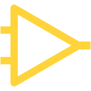

<h1 style="display: flex; text-align: center;">
  
  
Down to the Wire

</h1>

This repository represents and hosts my blog [downtothewire.io/blog](https://downtothewire.io/blog)

### License

The site customizes [sharadcodes/jekyll-theme-serial-programmer](https://github.com/sharadcodes/jekyll-theme-serial-programmer), which is [MIT Licensed](https://github.com/sharadcodes/jekyll-theme-serial-programmer/blob/main/LICENSE), and uses the [same license](https://github.com/wireddown/blog/blob/main/LICENSE).
